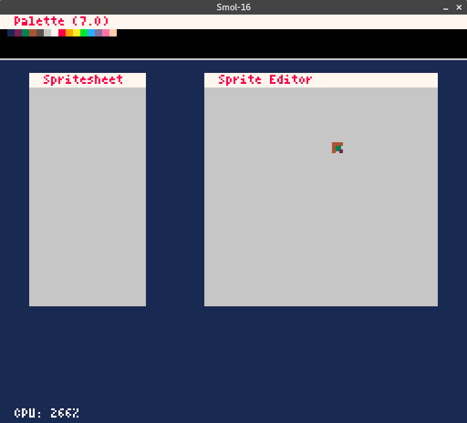

# Smol-16

Smol-16 is a fantasy game console, inspired by [Pico-8](http://www.lexaloffle.com/pico-8.php).
However, it's not a clone, but more or a "decendant". If the Pico-8 is the NES, then the Smol-16 is like the SNES.

While the Pico-8 had more of a *I could do this in a week* sort of philosophy, the Smol-16 is a **I can make a full game** sort of philosophy.

## Note
Smol-16 is in early development! Be wary about using it (though do contribute and watch it's progress!)

## Technical Specifications
* 256 x 224 pixel display (SNES resolution)
* 256 color palette (BGR-15 programmable)
* Program code is in Lua, no token limits

## Features
* A Lua standard library, editable by the user.
    * Treat it like editing the Microcode on a N64. It's to get as much performance as possible out of the machine

## Quirks
[TODO]
